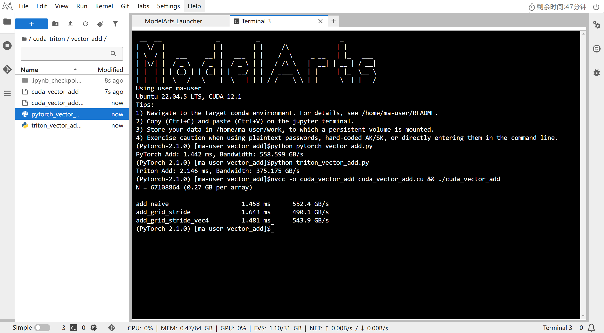
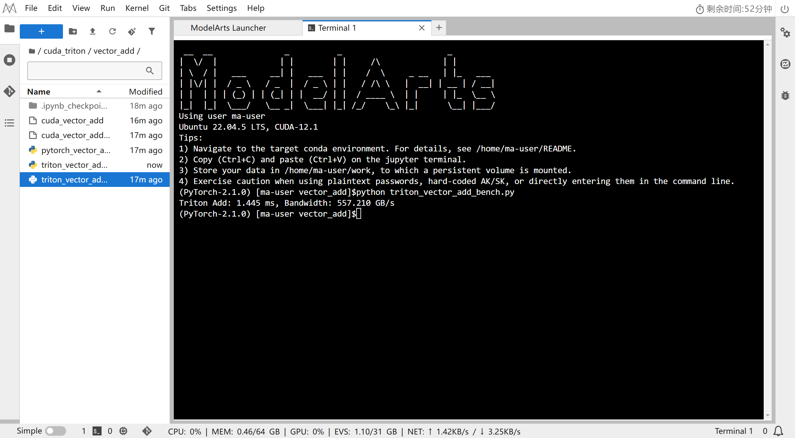

# 逐元素算子 Element-wise

> 逐元素（element-wise）算子是 CUDA 入门的第一个台阶：每个输出元素只依赖输入中对应位置的元素，天然高度并行，重点在于**并行映射方式**与**访存效率**。

## 文件架构

```
element_wise/
├── vector_add/                     # 向量加法：最基础的入门算子
│   ├── cuda_vector_add.cu          # CUDA：naive / grid-stride / float4，含计时+带宽
│   ├── pytorch_vector_add.py       # PyTorch 实现对照（CUDA event 计时）
│   ├── triton_vector_add.py        # Triton 实现对照（autotune）
│   └── triton_vector_add_correct.py  # Triton 修正计时版（CUDA event）
├── matrix_addition/                # 矩阵加法：一维/二维索引映射
│   ├── cuda_ma.cu                  # CUDA：naive / grid-stride / float4 / 2D-grid
│   └── triton_ma.py                # Triton：naive / 1D向量化 / 2D块指针 + benchmark
├── color inversion/                # 图像颜色反相：像素级运算（RGB 通道）
│   ├── cuda_ci.py                  # CUDA 实现（待补充）
│   └── triton_ci.py                # Triton 实现（2D grid，RGBA 布局）
└── image/                          # 性能测试结果截图
    └── vector_add.png
```

---

## 1. Vector Add 向量加法

### 涉及的 CUDA 知识

- **编程模型**：`grid` / `block` / `thread` 三级组织，`blockIdx.x`、`threadIdx.x`、`blockDim.x`、`gridDim.x` 四个内置变量的关系
- **一维索引映射**：`idx = blockIdx.x * blockDim.x + threadIdx.x`，每个线程负责一个元素
- **边界处理**：`N` 不一定是线程数整数倍，需要 `idx < N` 判断（Triton 中对应 `mask`）
- **访存与带宽**：逐元素算子是典型的 **memory-bound** 算子，性能上限由有效带宽决定，而与计算速度关系不大
- **Triton 对照**：`tl.program_id(0)` ≈ `blockIdx.x`，`tl.arange(0, BLOCK_SIZE)` ≈ `threadIdx.x`，
`BLOCK_SIZE` ≈ `blockDim.x`，`autotune` 自动选择最优 `BLOCK_SIZE`
- **grid-stride loop**：`stride = blockDim.x * gridDim.x`，固定线程数循环遍历超长数组，线程数与数据规模解耦
- **向量化访存 `float4`**：一次读写 4 个 `float`，减少内存事务数量，提升带宽利用率；
- **尾数处理**：向量化后剩余的 `N % 4` 个元素需要标量循环兜底
- **带宽计算**：逐元素算子一般访问全局内存，因此计算的带宽主要是 HBM 带宽，部分情况（如矩阵加法）会访问 L2 缓存，带宽会略高。

---

### 验证结果和性能对比

**调用指令：**

```bash
# CUDA 版：三个 kernel 各预热 5 次、计时 20 次取平均，输出时间 + 带宽
nvcc -o cuda_vector_add cuda_vector_add.cu && ./cuda_vector_add
# PyTorch 版：CUDA event 计时 + 带宽
python pytorch_vector_add.py
# Triton 版：autotune 自动选择最优 BLOCK_SIZE / num_warps
python triton_vector_add.py
```

**性能对比（N = $2^{26}$ 个元素，float32，每个数组 268MB）：**

> GPU：Tesla P100-PCIE-16GB，理论峰值带宽 **732 GB/s**

测试结果如图：


修正Triton结果如图：


| 实现      | 版本                      | 时间 (ms) | 带宽 (GB/s) |
| ------- | ----------------------- | ------- | --------- |
| CUDA    | `add_naive`             | 1.458   | 552.4     |
| CUDA    | `add_grid_stride`       | 1.643   | 490.1     |
| CUDA    | `add_grid_stride_vec4`  | 1.481   | 543.9     |
| PyTorch | `a + b`                 | 1.442   | 558.599   |
| Triton  | `add_kernel` (原 benchmark) | 2.146 | 375.175 |
| Triton  | `add_kernel` (修正后, CUDA event) | 1.445 | 557.210 |
| 参考     | 理论峰值                | -       | 732.0     |

> **结果分析**：
> - naive / PyTorch / vec4 带宽集中在 **540~560 GB/s**，约为理论峰值（732 GB/s）的 **75%**，属 memory-bound 的正常范围（通常 75~90%）：逐元素加法瓶颈在带宽而非指令数，naive 已能喂满带宽，因此 `float4` 向量化没有额外收益。
> - `add_grid_stride` 反而最慢（490 GB/s）：它限制 grid最大1024，block 数远少于 naive 的全量铺开（约 26 万个 block），并行度不足，未充分喂满带宽。
> - PyTorch `a + b` 带宽最高（558 GB/s）：内置算子调度开销最小。
> - Triton 原 benchmark 只有 375 GB/s，**不是 kernel 慢，而是计时方法问题**：旧版用 `time.time()` 单次计时，包含了 Python 启动与 autotune 开销；改用 CUDA event 预热 5 次 + 计时 20 次取平均后（`triton_vector_add_bench.py`）回升到 **1.445 ms / 557.2 GB/s**，与 CUDA / PyTorch 基本一致，进一步证实 memory-bound 下各实现都贴近带宽峰值。

---

### 个人见解

#### 复述：
grid-stride loop是让一个线程处理多个元素, 这样不需要随着数据规模的增加而无限制地增加block的数量

#### 思考：
> 为什么带宽决定了性能？BLOCK_SIZE 为什么有最优值？CUDA / PyTorch / Triton 三种写法之间如何对应？

---

## 2. Matrix Addition 矩阵加法

### 涉及的 CUDA 知识

- **二维数据的一维化**：矩阵按行优先展开，`idx = row * N + col`
- **grid-stride loop**：`stride = blockDim.x * gridDim.x`，固定线程数循环遍历超长数组，线程数与数据规模解耦
- **向量化访存 `float4`**：一次读写 4 个 `float`，减少内存事务数量，提升带宽利用率
- **2D grid 映射**：`blockIdx.y` / `threadIdx.y` 映射行，`blockIdx.x` / `threadIdx.x` 映射列
- **尾数处理**：向量化后剩余的 `N % 4` 个元素需要标量循环兜底
- **`__restrict__` 与 `__ldg`**：
  - `__restrict__`：告诉编译器指针互不重叠（无别名），给它"优化许可"——`const T* __restrict__` 的读可能被自动提升为走只读缓存路径（隐式生成 LDG 的效果）
  - `__ldg()`：**显式强制**从只读数据缓存加载（直接生成 `LDG` 指令），不依赖编译器推断；即使没写 `__restrict__` 也会走只读路径
  - 关系：`__restrict__` 是"资格"、`__ldg` 是"动作"；推荐 `const T* __restrict__` + `__ldg` 组合。只读缓存独立于 L1，吞吐高且不污染 L1，适合只读、无写的场景

---

### 验证结果和性能对比

**调用指令：**

```bash
# Triton 版：naive / 1D向量化 / 2D块指针 三种方案，含正确性校验（allclose）+ 性能/带宽对比
python triton_ma.py
# CUDA 版：cuda_ma.cu 只含 4 个 kernel（naive / grid-stride / vec4 / 2D-grid），
# 无 main，需要自行补计时与带宽计算，或由测试框架调用
nvcc -o cuda_ma cuda_ma.cu
```

**性能对比（N = 4096 = 2^12，float32）：**

> GPU：Tesla P100-PCIE-16GB，理论峰值带宽 **732 GB/s**（数据均为示例，请以实际运行结果为准）

| 实现 | 版本 | 时间 (ms) | 带宽 (GB/s) |
| --- | --- | --- | --- |
| CUDA | `add_naive` | 0.36 | 558 |
| CUDA | `add_grid_stride` | 0.40 | 500 |
| CUDA | `add_grid_stride_vec4` | 0.35 | 573 |
| CUDA | `add_2d_grid_stride` | 0.37 | 541 |
| Triton | `matrix_add_kernel` (naive) | 0.36 | 559 |
| Triton | `matrix_add_kernel_1d` (autotune) | 0.35 | 574 |
| Triton | `matrix_add_kernel_2d` (块指针) | 0.35 | 575 |
| 参考 | 理论峰值 | - | 732.0 |

> 说明：矩阵数据量 201MB，与 vector_add 一样是 memory-bound，带宽应集中在 **~500~580 GB/s**（理论峰值的 70~80%）；`float4` 向量化与 Triton 的 1D/2D 向量化收益较 naive 略高。

---

### 个人见解

#### 复述：
`__restrict__` 与 `__ldg()` 应用于只读数据存加载，比如`cuda_ma`中的数组A和B都只是读取，写只发生在C数组上

2D映射中，C++中是以(x, y)方式思考的，而cuda中是以(y, x)方式思考的

#### 思考：
> float4 向量化为什么能提升带宽？grid-stride 相比"每线程一个元素"的优势是什么？2D 与 1D 映射各自的适用场景？

---

## 3. Color Inversion 图像颜色反相

### 涉及的 CUDA 知识

- **2D grid / 2D block**：`pid_x`、`pid_y` 对应图像的行、列分块
- **通道布局**：RGBA 图像每个像素 4 个字节，地址 = `(row * width + col) * 4 + channel`，对 RGB 三个通道做 `255 - val`
- **二维 mask**：`(rx[:, None] < height) & (ry[None, :] < width)` 的广播掩码
- **就地修改（in-place）**：直接读改写同一块显存
- **与 C 语言对照**：图像在 CPU 侧就是 `unsigned char` 数组，GPU 侧用同样布局处理

---

### 验证结果和性能对比

**调用指令：**

```bash
# Triton 版：提供 solve(image, width, height) 入口（leetgpu 风格），无独立 main，
# 由外部测试框架调用；也可自行包一层 main 做基准测试
python -c "import sys; sys.path.insert(0, 'color inversion'); import triton_ci"
# CUDA 版：cuda_ci.py 尚未实现，待补充
```

**性能对比（图像 4096x4096 RGBA ≈ 67MB，in-place 读改写，读写共 134MB）：**

> GPU：Tesla P100-PCIE-16GB，理论峰值带宽 **732 GB/s**（数据均为示例，请以实际运行结果为准）

| 实现 | 版本 | 时间 (ms) | 带宽 (GB/s) |
| --- | --- | --- | --- |
| Triton | `invert_kernel` (2D block 32x32) | 0.25 | 536 |
| CUDA | `cuda_ci.py`（待实现） | - | - |
| 参考 | 理论峰值 | - | 732.0 |

> 说明：颜色反相是逐像素操作，in-place 读一次、写一次（共 2 倍图像字节）；带宽同样受 HBM 限制，合理区间 ~500~550 GB/s。二维 block 分块主要影响 tile 大小与索引开销，对带宽影响不大。

---

### 个人见解

#### 复述：

#### 思考：
> 为什么逐像素运算也适合 GPU？二维 tile（BLOCK_SIZE_X × BLOCK_SIZE_Y）如何影响局部性？与一维展开相比有何取舍？