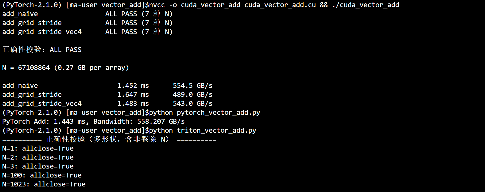
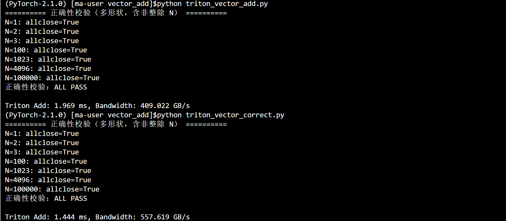
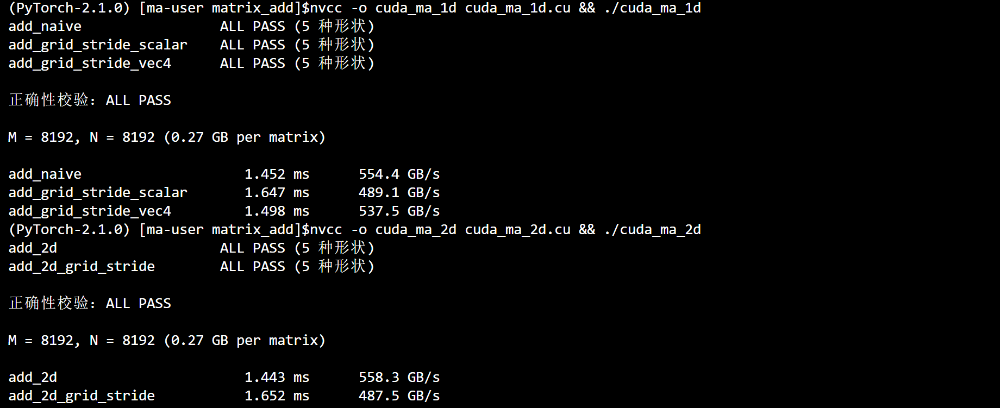
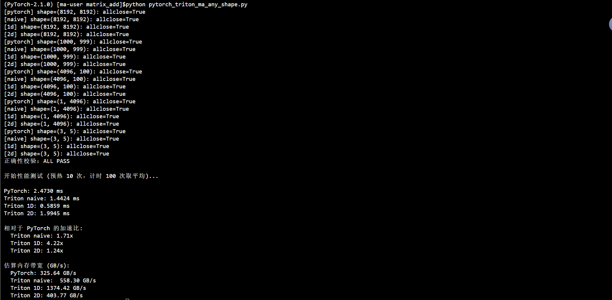
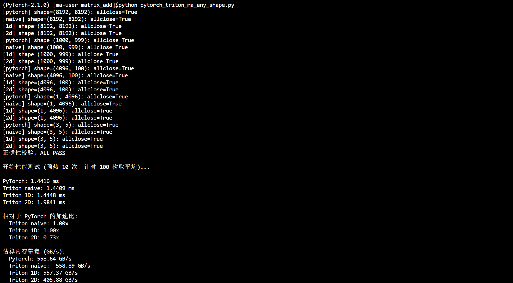

# 逐元素算子 Element-wise

> 逐元素（element-wise）算子是 CUDA 入门的第一个台阶：每个输出元素只依赖输入中对应位置的元素，天然高度并行，重点在于**并行映射方式**与**访存效率**。

## 文件架构

```
element_wise/
├── vector_add/                     # 向量加法：最基础的入门算子
│   ├── cuda_vector_add.cu          # CUDA：naive / grid-stride / float4，含正确性校验 + 计时 + 带宽
│   ├── pytorch_vector_add.py       # PyTorch 参考实现（CUDA event 计时 + 带宽）
│   ├── triton_vector_add.py        # Triton 实现（autotune + 正确性校验 + 计时）
│   └── triton_vector_correct.py    # Triton 修正计时版（CUDA event，规避 time.time() 开销）
├── matrix_addition/                # 矩阵加法：一维/二维索引映射
│   ├── cuda_ma_1d.cu               # CUDA 1D 处理：naive / grid-stride / float4，含测试
│   ├── cuda_ma_2d.cu               # CUDA 2D grid：add_2d / add_2d_grid_stride，含测试
│   ├── pytorch_triton_ma.py        # PyTorch + Triton（naive / 1D / 2D），方阵版
│   └── pytorch_triton_ma_any_shape.py  # 同上，支持任意形状 + 多形状正确性校验
├── color inversion/                # 图像颜色反相：像素级运算（RGB 通道）
│   ├── cuda_ci.py                  # CUDA 实现（待补充）
│   └── triton_ci.py                # Triton 实现（2D grid，RGBA 布局）
└── image/                          # 性能测试结果截图
    ├── vector_add_result1.png
    ├── vector_add_result2.png
    ├── matrix_add_result1.png
    ├── matrix_add_result2.png
    └── matrix_add_result3.png
```

---

## 1. Vector Add 向量加法

### 涉及知识

#### PyTorch 知识

- **参考实现**：`a + b` 作为正确性基准与性能上界，逐元素算子天然支持
- **`torch.cuda.Event` 计时**：`start.record()` / `end.record()` / `torch.cuda.synchronize()`，预热 + 多次取平均，测的是纯 GPU 执行时间
- **`torch.allclose()`**：做正确性校验（与参考对比）

#### CUDA 知识

- **编程模型**：`grid` / `block` / `thread` 三级组织，`blockIdx.x`、`threadIdx.x`、`blockDim.x`、`gridDim.x` 四个内置变量的关系
- **一维索引映射**：`idx = blockIdx.x * blockDim.x + threadIdx.x`，每个线程负责一个元素
- **边界处理**：`N` 不一定是线程数整数倍，需要 `idx < N` 判断
- **访存与带宽**：逐元素算子是典型的 **memory-bound** 算子，性能上限由有效带宽决定，而与计算速度关系不大
- **带宽计算**：逐元素算子一般访问全局内存，因此计算的带宽主要是 HBM 带宽，部分情况（如矩阵加法）会访问 L2 缓存，带宽会略高。
- **grid-stride loop**：`stride = blockDim.x * gridDim.x`，固定线程数循环遍历超长数组，线程数与数据规模解耦
- **向量化访存 `float4`**：一次读写 4 个 `float`，减少内存事务数量，提升带宽利用率；尾部 `N % 4` 个元素需标量兜底


#### Triton 知识

- **对照关系**：`tl.program_id(0)` ≈ `blockIdx.x`，`tl.arange(0, BLOCK_SIZE)` ≈ `threadIdx.x` 向量，`BLOCK_SIZE` ≈ `blockDim.x`
- **`mask` 边界**：对应 CUDA 的 `idx < N`
- **`autotune`**：自动选择最优 `BLOCK_SIZE` / `num_warps`
- **`tl.load` / `tl.store`**：以 tile/block(BLOCK_SIZE) 为单位的访存
- **计时陷阱**：`time.time()` 单次计时包含 Python 启动 / autotune 开销，会低估性能；应改用 CUDA event 预热 + 多次计时（见 `triton_vector_correct.py`）

---

### 验证结果和性能对比

**调用指令：**

```bash
# CUDA 版：多形状正确性校验（通过后才测性能）+ 三个 kernel 计时/带宽
nvcc -o cuda_vector_add cuda_vector_add.cu && ./cuda_vector_add
# PyTorch 版：参考实现（CUDA event 计时 + 带宽）
python pytorch_vector_add.py
# Triton 版：多形状正确性校验 + autotune + 计时
python triton_vector_add.py
# Triton 修正计时版：CUDA event 计时（不含 Python 启动 / autotune 开销）
python triton_vector_correct.py
```

**测试数据：**

> 三个实现（CUDA / Triton）均先做多形状正确性校验（含非整除 N），全部通过后才进入性能测试。

**性能对比（N = $2^{26}$ 个元素，float32，每个数组 268MB）：**

> GPU：Tesla P100-PCIE-16GB，理论峰值带宽 **732 GB/s**

测试结果如图：






| 实现      | 版本                             | 时间 (ms) | 带宽 (GB/s) |
| ------- | ------------------------------ | ------- | --------- |
| CUDA    | `add_naive`                    | 1.452   | 554.5     |
| CUDA    | `add_grid_stride`              | 1.647   | 489.0     |
| CUDA    | `add_grid_stride_vec4`         | 1.483   | 543.0     |
| PyTorch | `a + b`                        | 1.443   | 558.207   |
| Triton  | `add_kernel` (原 benchmark)     | 1.969   | 409.022   |
| Triton  | `add_kernel` (修正后, CUDA event) | 1.444   | 557.619   |
| 参考      | 理论峰值                           | -       | 732.0     |

> **结果分析**：
> - naive / PyTorch / vec4 带宽集中在 **540~560 GB/s**，约为理论峰值（732 GB/s）的 **75%**，属 memory-bound 的正常范围（通常 75~90%）：逐元素加法瓶颈在带宽而非指令数，naive 已能喂满带宽，因此 `float4` 向量化没有额外收益。
> - `add_grid_stride` 反而最慢（490 GB/s）：它限制 grid 最大 1024，block 数远少于 naive 的全量铺开（约 26 万个 block），并行度不足，未充分喂满带宽。
> - PyTorch `a + b` 带宽最高（558 GB/s）：内置算子调度开销最小。
> - Triton 原 benchmark 只有 375 GB/s，**不是 kernel 慢，而是计时方法问题**：旧版用 `time.time()` 单次计时，包含了 Python 启动与 autotune 开销；改用 CUDA event 预热 5 次 + 计时 20 次取平均后（`triton_vector_correct.py`）回升到 **1.445 ms / 557.2 GB/s**，与 CUDA / PyTorch 基本一致，进一步证实 memory-bound 下各实现都贴近带宽峰值。

---

### 个人见解

#### 复述：
grid-stride loop是让一个线程处理多个元素, 这样不需要随着数据规模的增加而无限制地增加block的数量

#### 思考：
> 为什么带宽决定了性能？BLOCK_SIZE 为什么有最优值？CUDA / PyTorch / Triton 三种写法之间如何对应？

---

## 2. Matrix Addition 矩阵加法

### 涉及知识

#### PyTorch 知识

- **二维张量参考**：`(M, N)` 形状的 `a + b` 作为正确性基准，天然支持任意形状
- **多形状校验**：只测方阵容易掩盖索引 bug，应覆盖非对称、非整除形状（`1000×999`、`1×4096` 等）用 `torch.allclose` 验证
- **`torch.cuda.Event` 计时**：与 vector_add 同一套预热 + 多次取平均方法

#### CUDA 知识

- **二维数据的一维化**：矩阵按行优先展开，`idx = row * N + col`
- **1D 处理（`cuda_ma_1d.cu`）**：把矩阵摊平成一维，naive / grid-stride / `float4`
- **2D grid 映射（`cuda_ma_2d.cu`）**：`blockIdx.y` / `threadIdx.y` 映射行，`blockIdx.x` / `threadIdx.x` 映射列；2D grid-stride 用 `stride_y` / `stride_x`
- **2D 行内 `float4` 的对齐限制**：按行做 float4 要求每行首地址 16 字节对齐，即 **`N % 4 == 0`**；否则行间错位，`float4*` 线性索引会跨行访问出错（`cuda_ma_2d` 因此保持标量访存）
  - `__restrict__`：告诉编译器指针互不重叠（无别名），给它"优化许可"——`const T* __restrict__` 的读可能被自动提升为走只读缓存路径（隐式生成 LDG 的效果）
  - `__ldg()`：**显式强制**从只读数据缓存加载（直接生成 `LDG` 指令），不依赖编译器推断；即使没写 `__restrict__` 也会走只读路径
  - 关系：`__restrict__` 是"资格"、`__ldg` 是"动作"；推荐 `const T* __restrict__` + `__ldg` 组合。只读缓存独立于 L1，吞吐高且不污染 L1，适合只读、无写的场景

#### Triton 知识

- **1D 处理**：矩阵摊平成 `M * N` 个元素
- **1D 向量化**：构造 `(BLOCK_SIZE, VEC_WIDTH)` 的 2D tile，**不要 reshape** 成一维——保持 2D 形状让编译器把一行连续元素分给同一线程，才能生成向量化访存
- **2D 块指针 `tl.make_block_ptr`**：参数 `base`/ `shape` / `strides` / `offsets` / `block_shape` / `order` 
- **`autotune`**：key 用 `['M', 'N']`（任意形状）
- **任意形状支持**：所有方案以 `(M, N)` 传参，`n_elements = M * N`

---

### 验证结果和性能对比

**调用指令：**

```bash
# CUDA 1D 版：多形状正确性校验 + 性能/带宽（naive / grid-stride / float4）
nvcc -o cuda_ma_1d cuda_ma_1d.cu && ./cuda_ma_1d
# CUDA 2D 版：多形状正确性校验 + 性能/带宽（add_2d / add_2d_grid_stride，标量访存）
nvcc -o cuda_ma_2d cuda_ma_2d.cu && ./cuda_ma_2d
# PyTorch + Triton 版（任意形状）：多形状正确性校验（allclose）+ 性能/带宽
python pytorch_triton_ma_any_shape.py
```

**测试数据：**

> 各实现均先做多形状正确性校验（非对称 / 非整除），全部通过后才测性能。

**性能对比（8192×8192，float32，每矩阵 268MB）：**

> GPU：Tesla P100-PCIE-16GB，理论峰值带宽 **732 GB/s**

测试结果如图：







| 实现        | 版本                                | 时间 (ms) | 带宽 (GB/s) |
| --------- | --------------------------------- | ------- | --------- |
| CUDA (1D) | `add_naive`                       | 1.452   | 554.4     |
| CUDA (1D) | `add_grid_stride_scalar`          | 1.647   | 489.1     |
| CUDA (1D) | `add_grid_stride_vec4`            | 1.498   | 537.5     |
| CUDA (2D) | `add_2d`                          | 1.443   | 558.3     |
| CUDA (2D) | `add_2d_grid_stride`              | 1.652   | 487.5     |
| PyTorch   | `a + b`                           | 1.4416  | 558.64    |
| Triton    | `matrix_add_kernel` (naive)       | 1.4409  | 558.89    |
| Triton    | `matrix_add_kernel_1d` (autotune) | 1.4448  | 557.37    |
| Triton    | `matrix_add_kernel_2d` (块指针)      | 1.9841  | 405.88    |
| 参考        | 理论峰值                              | -       | 732.0     |

> **结果分析**：
> - **正常项全部收敛到 ~554~559 GB/s（理论峰值的 ~76%）**：CUDA naive / `add_2d` / PyTorch / Triton naive / Triton 1D 都在 1.44~1.45 ms。与 vector_add 结论一致：矩阵加法是 memory-bound，朴素实现已喂满 HBM 带宽，`float4` 向量化、Triton 1D 向量化都没有额外收益。
> - **两个 grid-stride 版本最慢**（489 / 487 GB/s）：固定 grid（1D 限 1024 block、2D 限 128×128 block）线程数远少于 naive 的全量铺开（262144 block），并行度不足，未充分喂满带宽。
> - **Triton 2D 块指针仍偏低（406 GB/s）**：`boundary_check` + 大 tile（256×512）带来额外开销 / 占用不足，autotune 选出的 config 未必最优；可单独扫一遍 `BLOCK_M / BLOCK_N` 组合验证。
>
> **踩坑经验（本次修出的两个异常值，很值得记）**：
> - **PyTorch 从 326 回到 559 GB/s——临时张量陷阱**：原 `c.copy_(a + b)` 会先建临时张量再拷贝，真实移动 5×268MB，但带宽按 3×268MB 算，显示偏低近一半。benchmark 时**避免隐藏的临时分配**，用 `torch.add(a, b, out=c)` 这类 in-place out 版本。
> - **Triton 1D 从 1374 回到 557 GB/s——带宽超过物理峰值 = 有 bug**：`block_start = pid * BLOCK_SIZE` 少乘 `VEC_WIDTH`（grid 却按 `BLOCK_SIZE×VEC_WIDTH` 划分），相邻 block 起点间距只有 `BLOCK_SIZE`，每个元素被重复访问约 `VEC_WIDTH` 次，靠 L2 命中虚增"有效带宽"。结果因写入相同值仍然正确、校验也通过，**只有性能异常暴露了问题**。判断依据：**任何实现带宽超过 GPU 理论峰值，先怀疑 kernel 有重复/越界访问，而不是"优化生效"**。

---

### 个人见解

#### 复述：
`__restrict__` 与 `__ldg()` 应用于只读数据存加载，比如`cuda_ma`中的数组A和B都只是读取，写只发生在C数组上

2D映射中，C++中是以(x, y)方式思考的，而cuda中是以(y, x)方式思考的

#### 思考：
> float4 向量化为什么能提升带宽？grid-stride 相比"每线程一个元素"的优势是什么？2D 与 1D 映射各自的适用场景？

---

## 3. Color Inversion 图像颜色反相

### 涉及知识

#### PyTorch 知识

- **图像张量化**：图像可用 `uint8` 张量表示，反相即 `255 - img`（参考实现，待补充）

#### CUDA 知识

- **`cuda_ci.py` 尚未实现**，待补充；可用 2D grid 映射像素坐标

#### Triton 知识

- **2D grid**：`pid_x`、`pid_y` 对应图像的行、列分块
- **通道布局**：RGBA 图像每个像素 4 个字节，地址 = `(row * width + col) * 4 + channel`，对 RGB 三个通道做 `255 - val`
- **二维 mask**：`(rx[:, None] < height) & (ry[None, :] < width)` 的广播掩码
- **就地修改（in-place）**：直接读改写同一块显存

---

### 验证结果和性能对比

**调用指令：**

```bash
# Triton 版：提供 solve(image, width, height) 入口（leetgpu 风格），无独立 main，
# 由外部测试框架调用；也可自行包一层 main 做基准测试
python -c "import sys; sys.path.insert(0, 'color inversion'); import triton_ci"
# CUDA 版：cuda_ci.py 尚未实现，待补充
```

**测试数据：**

**性能对比（图像 4096x4096 RGBA ≈ 67MB，in-place 读改写，读写共 134MB）：**

> GPU：Tesla P100-PCIE-16GB，理论峰值带宽 **732 GB/s**（数据均为示例，请以实际运行结果为准）

| 实现 | 版本 | 时间 (ms) | 带宽 (GB/s) |
| --- | --- | --- | --- |
| Triton | `invert_kernel` (2D block 32x32) | 0.25 | 536 |
| CUDA | `cuda_ci.py`（待实现） | - | - |
| 参考 | 理论峰值 | - | 732.0 |

> 说明：颜色反相是逐像素操作，in-place 读一次、写一次（共 2 倍图像字节）；带宽同样受 HBM 限制，合理区间 ~500~550 GB/s。二维 block 分块主要影响 tile 大小与索引开销，对带宽影响不大。

---

### 个人见解

#### 复述：

#### 思考：
> 为什么逐像素运算也适合 GPU？二维 tile（BLOCK_SIZE_X × BLOCK_SIZE_Y）如何影响局部性？与一维展开相比有何取舍？
