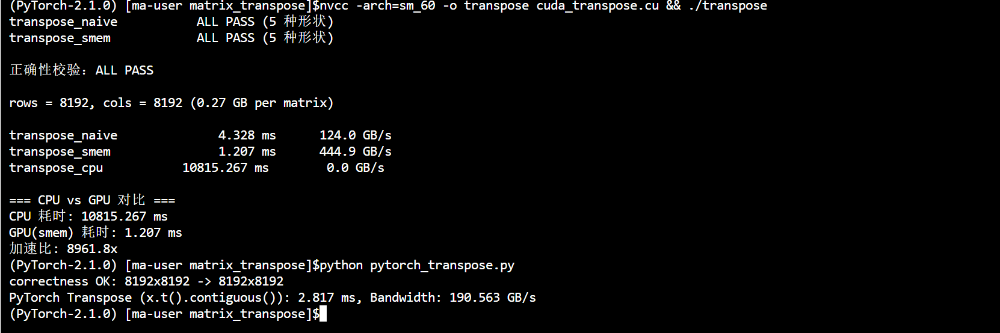
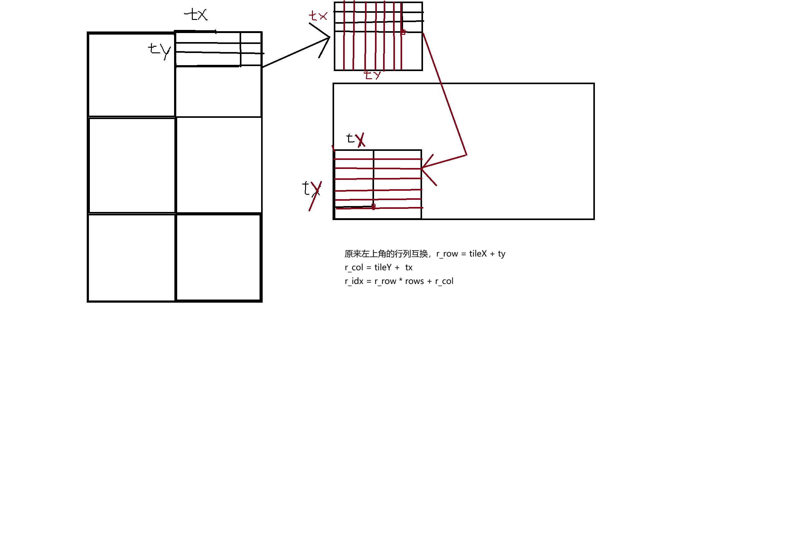

# 内存搬运 Memory Transfer

> 内存搬运类算子的关键不是"算"，而是**数据怎么搬**：全局内存与片上存储（共享内存/缓存）之间如何组织访问，直接决定带宽利用率。

## 文件架构

```
memory_transfer/
├── transpose/                      # 矩阵转置：把"读的行方向"变成"写的列方向"
│   ├── cuda_transpose.cu           # CUDA：naive / 共享内存 tile，含校验 + 计时 + 带宽 + CPU 参考
│   └── pytorch_transpose.py        # PyTorch 参考实现（x.t().contiguous()，CUDA event 计时 + 带宽）
└── image/
    └── transpose示意图.png         # 转置示意（行优先 → 列优先）
```

---

## 1. Transpose 矩阵转置

### 涉及知识

#### PyTorch 知识

- **参考实现**：`x.t()` 只返回**视图**（不搬数据），真正触发转置搬运的是 `x.t().contiguous()`，可作为正确性基准与性能上界
- **`torch.cuda.Event` 计时**：预热 + 多次取平均，测纯 GPU 执行时间；带宽 = 2×rows×cols×4 / time

#### CUDA 知识

- **2D grid 行-列映射**：`row = blockIdx.y * blockDim.y + threadIdx.y`，`col = blockIdx.x * blockDim.x + threadIdx.x`
- **转置索引**：`out[col * rows + row] = in[row * cols + col]`——读写走不同方向，是转置与逐元素算子的本质区别
- **边界判断**：必须 `row < rows && col < cols`；不能用 `idx < total`（`col` 越界但 `idx` 合法时，`col*rows+row` 会写穿 out 数组）
- **内存合并**：读端 `in[row*cols+col]` 连续（合并）；写端 `out[col*rows+row]` 每线程跨行（**不合并**，一个 warp 的写分散在 32 行，写放大）——naive 版慢的根源
- **共享内存 tile**：先把一个 32×32 tile 按行读入共享内存（合并），写出时交换 `threadIdx.x / threadIdx.y`（合并），让读写两个方向都连续
- **bank conflict**：共享内存分 32 个 bank，`tile[threadIdx.y][threadIdx.x]` 同一列（`threadIdx.x` 相同）会打同 bank → 冲突；`tile[TILE][TILE + 1]` 的 `+1` padding 错开列偏移，消除冲突
- **`__syncthreads()`**：阶段1（写 smem）与阶段2（读 smem）之间必须同步，否则读到未写入的数据

---

### 验证结果和性能对比

**调用指令：**

```bash
# CUDA 版：5 种形状正确性校验（含非方阵，通过后才测性能）+ naive/smem 两版计时与带宽 + CPU 参考计时
nvcc -arch=sm_60 -o transpose cuda_transpose.cu && ./transpose
# PyTorch 版：参考实现（x.t().contiguous()，CUDA event 计时 + 带宽）
python pytorch_transpose.py
```

**测试数据：**

> 正确性校验用 CPU 参考（`transpose_cpu`）逐元素对比，5 种形状含 `7×11`、`100×999` 等非方阵；性能测试为 8192×8192（2^26 个元素，float32，每矩阵 256MB，读+写共 512MB）。

**性能对比（8192×8192，读 in + 写 out = 512MB）：**

> GPU：Tesla P100-PCIE-16GB，理论峰值带宽 **732 GB/s**

测试结果如图：



| 实现      | 版本                                    | 时间 (ms)   | 带宽 (GB/s) |
| ------- | ------------------------------------- | --------- | --------- |
| CUDA    | `transpose_naive`                     | 4.328     | 124.0     |
| CUDA    | `transpose_smem`（共享内存 tile + padding） | 1.207     | 444.9     |
| PyTorch | `x.t().contiguous()`                  | 2.817     | 190.563   |
| CPU     | `transpose_cpu`（纯 C++ 双重循环）           | 10815.267 | 0.05      |
| 参考      | 理论峰值                                  | -         | 732.0     |

> **结果分析**：
> - **`transpose_naive` 只有 124 GB/s（写放大）**：写端每线程跨行，一个 warp 的写分散在 32 行、每行只写 4B，每个 32B sector 只用到 4B → 写放大 8 倍。实际 DRAM 搬运 ≈ 读 256MB + 写 256MB×8 ≈ 2.3GB，折算硬件带宽 ~520 GB/s，其实已贴近 HBM 上限——**瓶颈不是硬件，而是无效搬运占了大头**。这也是 naive 慢于逐元素 naive（554 GB/s）的原因：逐元素读写都合并，转置写端天然不合并。
> - **`transpose_smem` 445 GB/s，比 naive 快 3.6 倍**：共享内存 tile 让读写都合并，消除了写放大。但仍低于逐元素算子的 ~550 GB/s：多了一次共享内存中转 + `__syncthreads` 停顿，且 32×32 tile 写出跨 32 行带来 DRAM 行切换；可通过调整 tile 形状（如 32×8，减小每 block 写行数）进一步试优。
> - **PyTorch `x.t().contiguous()` 只有 190 GB/s，比手写 smem 慢 2.3 倍**：走 PyTorch 通用拷贝路径，读端按转置视图跨行迭代（不合并），未做共享内存 tile 优化——说明**框架内置路径并非最优，手写访存优化有实际价值**。
> - **CPU 10.8 s / 0.05 GB/s**：纯 C++ 双重循环无缓存优化，写端同样跨行；GPU(smem) 加速比约 **8960×**。

---

### 个人见解

#### 复述：
转置的难点不在计算，而在于读写方向相反：读一行是连续的，写一列却要跨行跳。共享内存 tile 的思路是"先按方便的方向搬进片上，再从片上按另一个方向搬出去"，让两段全局内存访问都保持合并，代价是多了一次共享内存读写 + 一次同步。

另外一个难点就是input和output的索引计算，可以参考如下示意图：




#### 思考：
> 为什么写端跨行访问会导致带宽骤降（内存事务浪费的具体机制）？bank conflict 与全局内存不合并访问有什么异同？非方阵（如 2048×512）时 tile 的边界线程如何处理？若用 Nsight Compute 看 naive 版，Global Store 的 Sectors/Req 应该会接近多少？

#### 回答（非方阵 tile 的边界线程处理）：

当 rows/cols 不是 tile（32）的整数倍时，grid 向上取整，边缘 block 里会有一批线程落在矩阵外（如 500×300：grid = ⌈300/32⌉×⌈500/32⌉，右/下边缘 block 部分线程越界）。kernel 用**两套独立边界判断**分别挡：

- **读入**（`cuda_transpose.cu:32`）：`if (myRow < rows && myCol < cols)`——按**原矩阵维度**挡，越界线程不写共享内存（槽位留垃圾值）
- **写出**（`cuda_transpose.cu:43`）：`if (outRow < cols && outCol < rows)`——按**转置后的维度**挡（行数=原列数），越界不写出

两套判断配合的关键：读端没写入的垃圾槽位，写端恰好不会读——写端读 `tile[i][j]`，该槽位由读端线程 `(j,i)` 写入，两者的越界条件对称一致，所以垃圾值永远不会被写出。注意非方阵**必须**用转置后的维度判断写端，若共用了读端边界会错位。