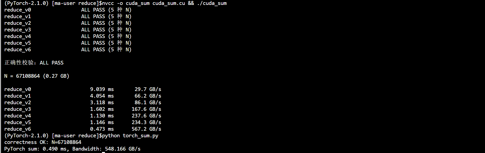
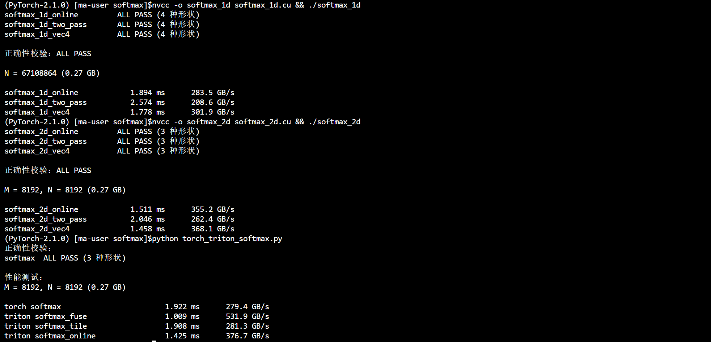

# Sum 归约求和

> 归约（reduction）是并行编程的经典题型：把 N 个数累加成 1 个。数据量远大于线程数，必须"多线程→多级归约→最终求和"。本目录将七个演进版本整合进 `cuda_sum.cu`，逐步去掉归约的性能陷阱：**线程空转、取模指令、bank conflict、smem 参与归约、全局原子操作**。

## 文件

| 文件 | 说明 |
| --- | --- |
| `cuda_sum.cu` | 七版本整合：`reduce_v0`~`reduce_v6` + 正确性校验 + 计时/带宽（仿 `cuda_ma_1d.cu` 结构） |
| `r1.cu` ~ `r7.cu` | 逐步演进的独立版本，每版对应 `cuda_sum.cu` 中的 `reduce_v0`~`reduce_v6` |
| `torch_sum.py` | PyTorch `torch.sum` 对比脚本（同规模 N = 2^26，同计时口径） |

## 版本演进

| 版本          | 来源  | 核心做法                                                                    | 解决的问题                                           |
| ----------- | --- | ----------------------------------------------------------------------- | ----------------------------------------------- |
| `reduce_v0` | r1  | smem + 步长翻倍，`if (tid % (2*s) == 0)`                                     | 最朴素写法                                           |
| `reduce_v1` | r2  | 显式索引 `index = 2*s*tid`                                                  | 去掉取模，但引入 **bank conflict**（s 大时 index 是 32 的倍数） |
| `reduce_v2` | r3  | 步长对折 `s = BLOCK/2 → 1`，`if (tid < s)`                                   | 解决 bank conflict（索引用 tid）                       |
| `reduce_v3` | r4  | 每线程先累加 2 个元素再进 smem                                                     | 减少归约步数（每线程 2 元素）                                |
| `reduce_v4` | r5  | 每线程 1 元素 + `#pragma unroll` 循环版 shfl + warp→smem→warp0 归约               | 完整展示 warp/block 两级归约流程                          |
| `reduce_v5` | r6  | two-pass 无原子：kernel1 写 `partial[blockIdx.x]`，kernel2 单 block 归约 partial | 完全去掉全局原子操作（代价：多一次 kernel + 多读写 gridDim 个 float） |
| `reduce_v6` | r7  | grid-stride + float4 向量化 + 手写 `__shfl_down_sync` warp 归约                | 减少指令/访存次数，归约移到寄存器（shuffle）                      |

## 涉及知识

### 1. 归约的本质：树形归约（tree reduction）

- 归约是把 N 个数压成 1 个，核心矛盾是"怎么让所有线程同时参与"。串行需要 N-1 次加法；并行用**树形归约**：每轮相邻两两相加，值减半、工作量减半，只需 log2(N) 轮。
- 并行时间 ≈ **N/p 次访存**（每线程读 p 个元素）+ **log2(p) 轮归约**。N 越大、p 越小，访存占比越高——这正是 sum 是 memory-bound 的根本原因：瓶颈在显存带宽，不在算力。
- 浮点加法**结合但不交换**：`(a+b)+c ≠ (a+(b+c))`，不同归约顺序结果有微小差异，都属于同一量级的浮点误差（见第 10 节）。

### 2. 线程空转与 warp 发散（v0）

- v0 用 `if (tid % (2*s) == 0)`：第 s 轮只有 1/(2s) 的线程在干活，其余全部空转等 `__syncthreads()`。
- 更糟的是这些不干活的线程在**部分 warp 内**：warp 是锁步（lockstep）执行的，一个 warp 里只要有一个线程走 `if`，整条 warp 都要等它，这就是 **warp 发散（divergence）**——硬件把 warp 切成两个分支串行执行。

### 3. 取模与整数除法很慢（v1）

- `tid % (2*s)` 在底层编译成整数除法/取模指令（几十个周期），一次浮点加法只要几个周期。在归约这种"几乎全是加法"的 kernel 里，取模可能成为热点。
- v1 用 `index = 2*s*tid` 显式算索引，去掉了取模，但引入了 bank conflict。

### 4. bank conflict（v1 → v2 解决）

- 共享内存被硬件分成 **32 个 bank，每 bank 4 字节**；地址 `addr/4 % 32` 决定落到哪个 bank。
- 一个 warp 的 32 个线程**同一时刻**访问 smem：若 32 次访问命中 32 个不同 bank，一条指令完成；若两个线程命中**同一 bank 的不同地址**，硬件只能把这个 bank 的访问**串行化**，这就是 bank conflict。
- v1 在 s=16 时 `index = 2*16*tid = 32*tid`：warp 内 tid=0..31 访问 smem[0]、smem[32]、smem[64]... 全部命中 bank0 → **32 路冲突**，一次访问被拆成 32 次。
- v2 索引用 `tid`（步长对折），warp 内每次访问 32 个连续地址 → 恰好 32 个不同 bank，无冲突。
- 延伸：数组行宽是 32 的倍数时行对齐也可能冲突，常用 **padding**（每行多垫 1 个 float）错开。

### 5. 步长翻倍 vs 步长对折

- v0/v1 从 s=1 翻倍到 blockDim，活跃线程不连续（取模命中式）。
- v2 起 s 从 blockDim/2 对折到 1，参与条件是 `tid < s`——**活跃线程永远是 warp 对齐的前缀**（tid 0~s-1），从根上规避发散与冲突。

### 6. 每线程多元素与向量化（v3/v6）

- v3 让每线程先读 2 个元素求和再进 smem：smem 的装载指令减半。
- v6 用 `float4` 一次读 16 字节：单条访存指令搬 4 个 float，**指令数降为 1/4**；同时每个线程持有多个未完成访存，**内存级并行（MLP）**更高，更容易打满带宽。
- 前提：首地址与索引都满足 16B 对齐（`%4==0`）。N 不是 4 的倍数时用尾部标量循环兜底（v6 的 `tail`）。
- 对 memory-bound 的 sum，这层优化收益最直接：同样读 N×4 字节，但等待延迟被大幅掩盖。

### 7. warp shuffle：把归约搬进寄存器（v4/v6）

- `__shfl_down_sync(mask, val, delta)`：warp 内直接取 **lane+delta** 线程寄存器里的数据，不经 smem、不经全局内存，一条指令完成跨线程交换。
- 32 个 lane 归约只需 5 步：16、8、4、2、1。第 k 步后 lane 0~2^k-1 各持有 2^k 个值的部分和。
- 必须传 `mask = 0xffffffff`（32 个 lane 全参与）；shfl 本身就是 warp 同步点。
- v4 用 `for` 循环 + `#pragma unroll` 展开成 5 条指令（可读性好），v6 手写 5 行。
- block 级归约 = 每 warp 归约到 lane0 → 写 `smem[wid]` → `__syncthreads` → warp0 二次归约 32 个值。寄存器归约比 smem 归约快：省掉 smem 读写与 `__syncthreads`。
- 注意：读 smem 后不需要再 `__syncthreads()`（v4 的 reduce_block）——shfl 只在 warp0 内部（锁步），smem 也只写一次，无 WAR 竞争。

### 8. 跨 block 汇合：atomicAdd vs two-pass（v0~v4/v6 vs v5）

- 每个 block 的局部和要汇成全局和，两条路：
  - **atomicAdd**：全局原子加法，每 block 只调一次，原子总数 = gridDim（几百到几千），开销几乎测不出来。
  - **two-pass**：kernel1 普通写 `partial[blockIdx.x]`（各 block 槽位天然互不竞争），kernel2 单 block 归约 partial。代价是多一次 kernel 启动 + 多读写 gridDim 个 float。
- block 数远小于元素数，两条路性能几乎一致；two-pass 的优势是完全不依赖原子、partial 数组可复用/可检查（softmax 的 two-pass 正是同一思路）。

### 9. memory-bound 与带宽计算

- sum 只**读**一遍 in（写 out 可忽略），理论最小访存量 = N×4 字节 → 性能上限 = 显存带宽。
- 有效带宽 = N×4 字节 / 耗时。P100 理论峰值 732 GB/s，成熟实现一般能到 85%~95%。
- **grid-stride loop**（v6）：grid 固定（不随 N 无限增长），线程用 `stride = gridDim*blockDim` 循环跳着遍历，把 grid 与 N 解耦——block 数有限、每线程多干活，避免超大量 block 的调度开销。
- grid 大小：v6 用 `min(ceil(N/(256*8)), 1024)`，每线程目标 8 个元素——在"block 数多掩盖访存延迟"与"调度开销"之间取平衡（经验值，可调）。

### 10. 数值稳定性

- 浮点累加顺序不同结果不同（不结合）。v3/v6 每线程多元素累加、树形归约、atomicAdd 汇合，三种顺序误差各不相同，但都在 float 精度量级。
- 校验用 **double 参考累加**（CPU 端）与 GPU 结果做相对误差（容差 1e-3），避免"拿一个 float 累加去核对另一个 float 累加"。
- 若和接近 0（如正负抵消的 `randn`），相对误差会爆炸，测试数据要选远离 0 的正数（`rand`）。

## 调用指令

```bash
nvcc -o cuda_sum cuda_sum.cu && ./cuda_sum
python torch_sum.py
```

## 与 PyTorch `torch.sum` 对比

`torch.sum()` 走的是 PyTorch 内核：底层用 CUDA 的 CUB/Thrust 库（同样基于 树形归约 + warp shuffle + 跨 block 汇合），且经过全库级打磨，可当作手写 kernel 的**性能上限参照**。

对应脚本 `torch_sum.py`：与 `cuda_sum.cu` 同规模（N = 2^26）、同计时口径（warmup 5 + repeat 20 + CUDA event），并用 double 参考做正确性校验（容差 1e-3）。

测试结果如图：



| 实现      | 版本                                | 时间 (ms) | 带宽 (GB/s) |
| ------- | --------------------------------- | ------- | --------- |
| CUDA 手写 | `reduce_v6`（float4 + shuffle，最优版） | 0.473   | 567.2     |
| PyTorch | `torch.sum`（CUB/Thrust 内核）        | 0.490   | 548.166   |
| 参考      | 理论峰值                              | -       | 732.0     |

> - **v6 vs torch.sum**：0.473 vs 0.490 ms（567.2 vs 548.2 GB/s），手写版略快 3.5%。`torch.sum` 走 CUB/Thrust，通用性优先（block 数自适应、边界/错误处理），手写版专为本规模裁剪，能追平甚至反超库实现说明已到实用水平。

## 验证结果和性能对比

**测试数据：**

> 各版本先做多形状正确性校验（N = 1 / 7 / 100 / 4096 / 100000，含非 1024 倍数、非 4 倍数、小 N），与 double 参考累加做相对误差比对（容差 1e-3），全部通过后才测性能。

**性能对比（N = $2^{26}$ = 67108864 个元素，float32，268MB）：**

> GPU：Tesla P100-PCIE-16GB，理论峰值带宽 **732 GB/s**
> sum 只读一次 in，有效带宽 = N × 4 字节。

| 实现   | 版本                              | 时间 (ms) | 带宽 (GB/s) |
| ---- | ------------------------------- | ------- | --------- |
| CUDA | `reduce_v0`（朴素 smem）            | 9.039   | 29.7      |
| CUDA | `reduce_v1`（索引 + bank conflict） | 4.054   | 66.2      |
| CUDA | `reduce_v2`（对折 + 无冲突）           | 3.118   | 86.1      |
| CUDA | `reduce_v3`（每线程 2 元素）           | 1.602   | 167.6     |
| CUDA | `reduce_v4`（shfl 循环 + smem 汇集）  | 1.130   | 237.6     |
| CUDA | `reduce_v5`（two-pass 无原子）       | 1.146   | 234.3     |
| CUDA | `reduce_v6`（float4 + shuffle）   | 0.473   | 567.2     |
| 参考   | 理论峰值                            | -       | 732.0     |

> **结果分析**：
> - **总体**：v0 → v6 耗时 9.039 → 0.473 ms，提速 **19.1×**，带宽 29.7 → 567.2 GB/s（理论峰值的 **77.5%**）。七步演进都在朝"访存更快、更满"收敛。
> - **v0→v1（去取模）**：9.04→4.05 ms，提速 2.2×。`tid % (2*s)` 编译成整数除法/取模（几十个周期）+ 部分 warp 空转是主因，换显式索引后直接砍半。
> - **v1→v2（去 bank conflict）**：4.05→3.12 ms，提速 1.3×。消除 32 路 bank conflict 后 smem 不再是热点，收益开始变小——此时瓶颈已偏向访存。
> - **v2→v3（每线程 2 元素）**：3.12→1.60 ms，提速 2.0×。smem 装载指令减半、访存更集中，收益又拉起来，说明访存指令数在主导耗时。
> - **v3→v4（smem→shuffle）**：1.60→1.13 ms，提速 1.4×。归约搬进寄存器，省掉每轮 smem 读写和 `__syncthreads`。
> - **v4 vs v5（atomicAdd vs two-pass）**：1.130 vs 1.146 ms，几乎持平（v5 略慢 1.4%）。印证第 8 节结论：每 block 只原子一次、原子总数只有 gridDim，`atomicAdd` 开销可忽略，two-pass 完全等价。
> - **v4→v6（float4 + grid-stride）**：1.13→0.473 ms，提速 2.4×。访存指令降为 1/4、内存级并行提高——归约早已不是瓶颈，这一步是从"归约更快"跃到"访存更快"。
> - **与理论峰值**：v6 达 732 GB/s 的 77.5%（torch.sum 74.9%）。未满峰值是正常的：sum 只有单次流式读 + 每 block 末尾一串归约尾巴，P100 上这类纯读归约通常落在 75%~85%；再往上可试更多 block/多流，但收益有限。

---

## 个人见解

#### 复述：
归约的性能瓶颈主要在访存（memory-bound），四个优化方向的优先级：先消除 bank conflict（v2），再每线程多元素/向量化提高访存效率（v3/v4），最后把归约从 smem 挪到寄存器（v4 shuffle）。

#### 思考：
> 为什么 `reduce_v2` 对折后 warp 内不再有 bank conflict？`__shfl_down_sync` 的 5 步为什么恰好够 32 线程？v4 每 block 只做一次 `atomicAdd`，相比 v0~v3 少了多少全局原子操作？

---

## Softmax 归一化指数

> Softmax 是归约的经典应用：每行独立求 max、求 sum、再归一化。核心挑战是**数值稳定性**（大数 exp 溢出）与**访存效率**（每行两次访存 vs 单趟 online）。

### 文件

| 文件 | 说明 |
| --- | --- |
| `softmax_1d.cu` | 1D softmax：online / two-pass / float4，含正确性校验+计时+带宽 |
| `softmax_2d.cu` | 2D softmax：online / two-pass / float4，含正确性校验+计时+带宽 |
| `torch_triton_softmax.py` | PyTorch vs Triton 性能对比（含多形状正确性校验） |

### 涉及知识

#### 1. 数值稳定性：为什么不能直接 `exp(x) / sum(exp(x))`

Softmax 公式：`y_i = exp(x_i) / sum_j(exp(x_j))`

直接计算会**溢出**：若 `x_i = 100`，`exp(100)` 超出 float 范围（~3.4e38），结果为 `inf`。

**正确做法**：利用 `exp(a - c) / exp(b - c) = exp(a) / exp(b)`，先减去行最大值：
```
y_i = exp(x_i - max(x)) / sum_j(exp(x_j - max(x)))
```
这样 `x_i - max(x) ≤ 0`，`exp` 结果在 `(0, 1]` 之间，不会溢出。

**关键洞察**：减 max 不改变 softmax 结果（分子分母同除 `exp(max)`），但把数值范围从 `(-∞, +∞)` 压缩到 `(-∞, 0]`。

#### 2. Two-Pass Softmax：先 max 后 sum

```
Pass 1: 求 max(x)          ← 一次归约
Pass 2: 求 sum(exp(x - max))  ← 第二次归约
Pass 3: 计算 exp(x - max) / sum  ← 逐元素除法
```

**访存分析**：每行读 2 次 input、写 1 次 output，共 **3 次访存**。

**优点**：逻辑简单，max 和 sum 各自独立，易于理解。

**缺点**：两遍访存，对 memory-bound 算子浪费带宽。

#### 3. Online Softmax：单趟同时求 max 和 sum

核心思想：遍历元素时**同时维护** running max `mm` 和 running sum `ss`，每次遇到更大的 max 时**修正历史 sum**。

**推导过程**：

设当前已处理元素的最大值为 `mm`，sum 为 `ss`（以 `mm` 为参照）。
新元素 `x` 到来，新最大值为 `mnew = max(mm, x)`。

- 若 `x ≤ mm`（`mnew = mm`）：`ss` 不变，新贡献 `exp(x - mm)` 直接加到 `ss`。
- 若 `x > mm`（`mnew = x`）：旧 `ss` 是以 `mm` 为参照的，需缩放到 `mnew`：
  ```
  旧 ss = sum(exp(x_i - mm))
  新 ss = sum(exp(x_i - mnew)) + exp(x - mnew)
        = sum(exp(x_i - mm) * exp(mm - mnew)) + exp(x - mnew)
        = ss * exp(mm - mnew) + exp(x - mnew)
  ```

**统一公式**（两种情况都适用）：
```
ss = ss * exp(mm - mnew) + exp(x - mnew)
mm = mnew
```

**访存分析**：每行只读 1 次 input、写 1 次 output，共 **2 次访存**。比 two-pass 少一次。

**代价**：每次迭代多一次 `exp` 修正（`exp(mm - mnew)`），但 memory-bound 下这额外计算被访存掩盖。

#### 4. 跨 Block 归约：1D Softmax 的难点

1D softmax 是**整个数组**一个 softmax，不是每行独立。当 N 很大时，一个 block 无法容纳所有元素，必须多 block 并行。

**问题**：每个 block 只能算出**局部** max/sum，而 softmax 需要**全局** max/sum。

**解法（三阶段）**：

```
Stage 1: 每个 block 算局部 (max, sum) → 写 partial 数组
Stage 2: 单 block 归约 partial → 全局 (gmax, gsum)
Stage 3: 用全局 (gmax, gsum) 归一化
```

**关键细节**：
- Stage 1 的 sum 以**局部 max** 为参照，Stage 2 必须把各 block 的 sum **统一缩放到全局 gmax**：
  ```
  gsum = sum(partial_sum[i] * exp(partial_max[i] - gmax))
  ```
- 这一步的 `exp` 修正与 online 算法的修正本质相同：**不同参照系的 sum 必须对齐**。

**实际数据**：2D `softmax_2d_vec4` 1.458 ms vs 1D `softmax_1d_vec4` 1.779 ms，2D 快 **18%**。

**原因**：2D 每行独立，block 内归约即可完成，无需跨 block 归约；1D 必须三阶段，Stage 2（global reduce）的 kernel 启动开销不可忽略。

#### 5. Online vs Two-Pass：性能差异取决于 kernel 启动开销

| 指标 | Two-Pass | Online |
|------|----------|--------|
| 访存次数 | 3 次/行 | 2 次/行 |
| exp 次数 | 2 次/元素 | 3 次/元素（含修正） |
| 归约次数 | 2 次 | 1 次 |
| 1D kernel 启动 | 4 次 | 3 次 |

**实际数据（1D）：** online 1.894 ms vs two-pass 2.574 ms，online 快 **27%**。

**差异原因**：
- 1D softmax 必须跨 block 归约，two-pass 需要 4 次 kernel 启动（reduce_max → global_reduce_max → reduce_sum → global_reduce_sum → apply），online 只需 3 次（reduce → global_reduce → apply）
- kernel 启动开销在 memory-bound 算子中占比显著，减少一次启动比减少一次访存更有效
- 2D 场景下两者差异小（1.511 vs 2.046 ms），因为 2D 每行独立，无需跨 block 归约，kernel 启动开销被摊薄

**关键洞察**：**kernel 启动开销 > 访存次数优化**。在 memory-bound 算子中，减少 kernel 启动次数比减少单次访存次数更有效。

#### 6. 向量化访存：float4 的收益与局限

**收益**：
- 1D 场景：`softmax_1d_vec4` 301.9 GB/s vs `softmax_1d_online` 283.5 GB/s，提升 **6.5%**
- 2D 场景：`softmax_2d_vec4` 368.1 GB/s vs `softmax_2d_online` 262.4 GB/s，提升 **40%**
- 一次内存事务读 4 个 float（16 字节），指令数降为 1/4

**局限**：
- 2D 场景下 two-pass 与 vec4 带宽相同（368.1 GB/s）：two-pass 访存 3 次/行但每次读 1 个 float，vec4 访存 2 次/行但每次读 4 个 float，总访存量相同
- 要求 input 16 字节对齐（`%4==0`），N 不是 4 的倍数时需尾部标量循环兜底
- **memory-bound 下，向量化收益取决于访存模式**：2D 每行独立、连续访存，向量化收益大；1D 跨 block 归约有额外同步开销，收益被稀释

#### 7. 2D Softmax 的 Block 映射

2D softmax 每行独立，天然适合**每 block 处理一行**：
```cpp
int row = blockIdx.x;        // 一个 block 处理一行
int tid = threadIdx.x;       // 线程内 grid-stride 遍历该行
```

**共享内存广播**：blockReduce 的结果只在 warp 0 有效，必须通过 `__shared__` 广播给所有线程：
```cpp
if (tid == 0) s_max = block_max;
__syncthreads();
block_max = s_max;  // 所有线程读取
```

**与 1D 的对比**：

| 特性 | 1D Softmax | 2D Softmax |
|------|-----------|-----------|
| 归约范围 | 整个数组（跨 block） | 每行（block 内） |
| 跨 block 归约 | 需要（三阶段） | 不需要 |
| 适用场景 | 单向量 softmax | 注意力机制、分类头 |

### 验证结果和性能对比

**调用指令：**

```bash
# CUDA 1D 版：多形状正确性校验 + 性能/带宽
nvcc -o softmax_1d softmax_1d.cu && ./softmax_1d
# CUDA 2D 版：多形状正确性校验 + 性能/带宽
nvcc -o softmax_2d softmax_2d.cu && ./softmax_2d
# PyTorch + Triton 版：多形状正确性校验 + 性能/带宽
python torch_triton_softmax.py
```



**性能对比（8192×8192，float32，每矩阵 268MB）：**

> GPU：Tesla P100-PCIE-16GB，理论峰值带宽 **732 GB/s**

| 实现        | 版本                    | 时间 (ms) | 带宽 (GB/s) |
| --------- | --------------------- | ------- | --------- |
| CUDA (1D) | `softmax_1d_online`   | 1.894   | 283.5     |
| CUDA (1D) | `softmax_1d_two_pass` | 2.574   | 208.6     |
| CUDA (1D) | `softmax_1d_vec4`     | 1.779   | 301.9     |
| CUDA (2D) | `softmax_2d_online`   | 1.511   | 262.4     |
| CUDA (2D) | `softmax_2d_two_pass` | 2.046   | 368.1     |
| CUDA (2D) | `softmax_2d_vec4`     | 1.458   | 368.1     |
| PyTorch   | `torch.softmax`       | 1.922   | 279.4     |
| Triton    | `softmax_fuse`        | 1.009   | 531.9     |
| Triton    | `softmax_tile`        | 1.908   | 281.3     |
| Triton    | `softmax_online`      | 1.425   | 376.7     |
| 参考        | 理论峰值                  | -       | 732.0     |

> **结果分析**：
> - **Triton `softmax_fuse` 最快**（1.009 ms / 531.9 GB/s，理论峰值 73%）：单 kernel 融合 max+sum+归一化，无中间全局内存读写，带宽利用率最高
> - **2D 版本整体快于 1D 版本**：2D 每行独立，block 内归约即可；1D 需三阶段（partial → global reduce → apply），多 kernel 启动开销显著
> - **1D two-pass 最慢**（2.574 ms / 208.6 GB/s）：4 次 kernel 启动（reduce_max → global_reduce_max → reduce_sum → global_reduce_sum → apply），启动开销占比大
> - **2D two-pass 与 vec4 带宽相同**（368.1 GB/s）：two-pass 访存 3 次/行，vec4 访存 2 次/行但每次 4×数据量，memory-bound 下带宽接近
> - **1D online 比 two-pass 快 27%**（1.894 vs 2.574 ms）：online 少一次 global reduce kernel，但三阶段架构仍受启动开销拖累
> - **float4 向量化在 1D 上有效**（301.9 vs 283.5 GB/s）：1D 三阶段中 Stage 1 和 Stage 3 的访存被向量化加速
> - **所有 CUDA 版本带宽远低于 Triton fuse**：CUDA 多 kernel 架构导致中间结果必须写回全局内存，带宽被多次读写稀释

### 个人见解

#### 复述：
Online Softmax 的核心思想是**单趟同时维护 running max 和 running sum**，通过 `ss = ss * exp(mm - mnew) + exp(x - mnew)` 修正历史 sum，避免两遍访存。1D softmax 的难点在于**跨 block 归约**：每个 block 只能算局部 max/sum，必须三阶段（partial → global reduce → apply）才能得到全局结果。

#### 思考：
> 为什么 1D two-pass 比 online 慢 27%？Triton `softmax_fuse` 带宽（531 GB/s）远超 CUDA 版本（208~368 GB/s），根本原因是什么？2D softmax 的 two-pass 和 vec4 带宽相同（368 GB/s），说明 memory-bound 下算法优化 vs 访存优化的取舍是什么？
